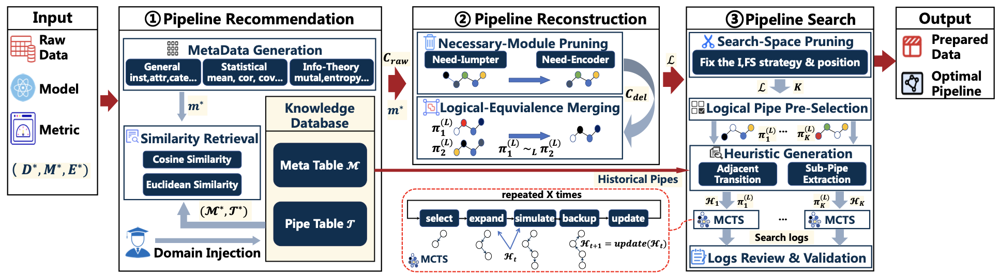

# MAPPipe: Navigating to Optimal Data Preprocessing Pipelines via Structural Pruning and Knowledge-augmented MCTS



## Overview
`MAPPipe` is a knowledge-augmented, neural-free framework for automated preprocessing on tabular data.  
It targets the core AutoML bottleneck: finding high-quality preprocessing pipelines under strict evaluation budgets.

1. A knowledge-augmented, surrogate-free architecture that unifies pipeline recommendation, reconfiguration, and search, transforming exponential combinatorial optimization into guided exploration within a high-potential subspace.
2. A pruning strategy based on large-scale empirical analysis to aggressively compress the instantiation space by 99.58% while preserving near-optimal reachability.
3. A customized, neural-free MCTS with heuristic guidance for reliable near-optimal pipeline discovery under limited evaluation budgets.

## Key Ideas
- Three-stage optimization: **recommendation -> reconfiguration -> search**.
- Structural pruning to dramatically reduce search space while preserving high-value candidates.
- Heuristic-guided MCTS without neural surrogate models.

## Quick Start
### 1) Create Conda environment
```bash
conda create -n mappipe python=3.10 -y
conda activate mappipe
python -m pip install --upgrade pip
pip install -r requirements.txt
```

Tested runtime:
- Python `3.10`
- See pinned packages in [`requirements.txt`](./requirements.txt)

### 2) Run on a single dataset
```bash
python kamcts_main.py \
  --dataset_path data/diffprep/egg.csv \
  --model LogisticRegression \
  --metric accuracy \
  --max_iter 30 \
  --subset_size 5000 \
  --output_dir output/single_run
```

## Repository Structure
```text
MAPPipe/
├── kamcts_main.py                                  # Main CLI entry
├── NewOperators.py                                 # Compatibility facade
├── mcts_refactor/
│   ├── recommendation.py                           # Stage 1: pipeline recommendation
│   ├── refactor_stage.py                           # Stage 2: pipeline reconfiguration
│   ├── search_stage.py                             # Stage 3: MCTS search
│   ├── orchestrator.py                             # Pipeline orchestration
│   └── common.py
├── new_operator_core/
│   ├── models.py
│   ├── pipeline_builder.py
│   └── preprocessing/
│       ├── imputation.py
│       ├── outlier.py
│       ├── encoding.py
│       ├── normalization.py
│       ├── feature_transform.py
│       └── feature_selection.py
├── data/
│   ├── diffprep/
│   └── deepline/
└── Knowledge/
    ├── metaldata/
    │   └── Newmetal_data.csv                       # Shared metadata for all downstream models
    └── model_metric/
        ├── LogisticRegression/accuracy/{csv,json}
        ├── KNN/accuracy/{csv,json}
        ├── DecisionTree/accuracy/{csv,json}
        └── SVM/accuracy/{csv,json}
```

## Dataset Sources
- `data/diffprep/`: datasets from the DiffPrep benchmark setting ([DiffPrep](https://github.com/chu-data-lab/DiffPrep)).
- `data/deepline/`: datasets from the DeepLine benchmark setting ([DeepLine / gym-deepline](https://github.com/yuvalhef/gym-deepline)).

## Knowledge Base Construction Sources
The datasets used to build the knowledge base (`Knowledge/metaldata/Newmetal_data.csv` and `Knowledge/model_metric/...`) are sourced from:
- OpenML-CC18 benchmark suite: [https://www.openml.org/s/99](https://www.openml.org/s/99)
- AutoML Benchmark datasets: [https://github.com/automlbenchmark/automlbenchmark](https://github.com/automlbenchmark/automlbenchmark)

## Input/Output
### Input assumptions
- CSV tabular data.
- Target column is the last column by default (or set `--target_column`).
- Main workflow splits train/test with ratio **4:1**.

### Outputs (`--output_dir`)
- `processed_train.csv`
- `processed_test.csv`
- `best_pipeline.json`
- `run_report.json`

## Reproducibility Notes
- For fair comparison, keep identical train/test split policy and search budget (`max_iter`, `subset_size`).
- `max_iter` recommendation:
  - Ablation setting in this project uses `max_iter=30`.
  - If computation budget is sufficient, you can increase it to `40` or `50`.
  - A larger budget can still increase the risk of getting trapped in local optima.

